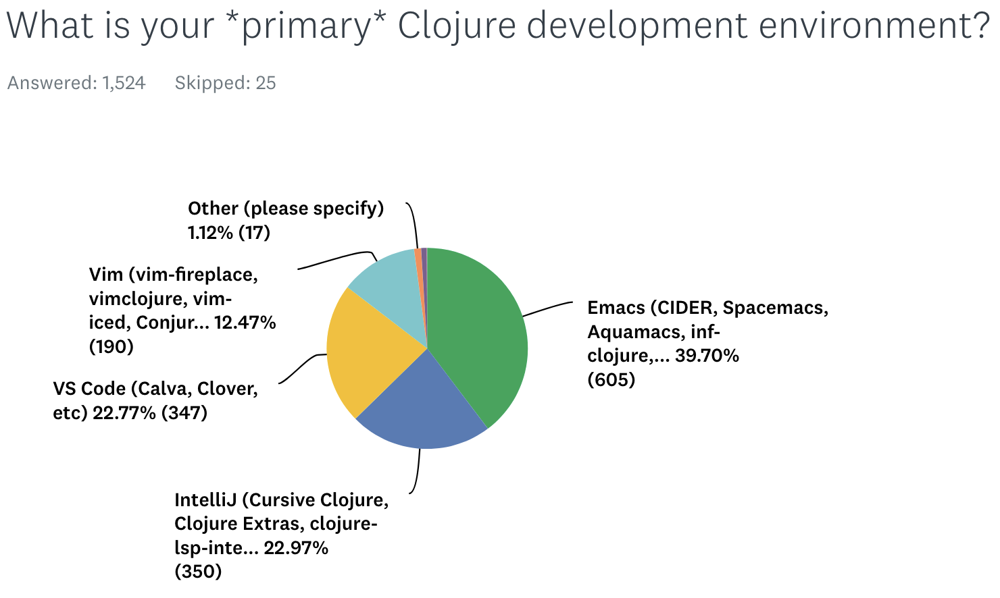

# Preface: What Should You Learn After AI Accelerates Coding?

> Emacs is a Lisp machine, disguised as a text editor.
>
> (Emacs community proverb)

As a Clojure Programmer, I've always had one regret: the most popular editor in the Clojure community is Emacs (with about 40% usage), but I've never been able to learn it.
 
What's special about Emacs is that its plugin language is Elisp—a Lisp. For Lisp developers, this is like a productivity boost, allowing easy customization of the editor.



The problem is: I'm really not used to Emacs, and while Neovim supports Lua and VimScript, it doesn't have Lisp. It wasn't until I discovered Fennel—a Lisp that compiles to Lua—that Neovim truly gained a Lisp option.

After developing several plugins with Fennel, I found that it not only solved my Emacs problem but also made me rethink: in the age of AI, what impact do choices in programming languages and development paradigms still have on productivity?

## Software Development in the AI Era

By 2025, many engineers will likely be using AI to assist in software development, [and I'm no exception](https://replware.substack.com/p/a-conjure-piglet-client). In the process of applying AI to software development, I found that the programming languages and paradigms I've used for years are not only not outdated but have instead highlighted their value even more. They were originally excellent tools for improving **programming bottlenecks**, and with AI, the existing bottlenecks in programming activities have become even more pronounced than before.

Generally speaking, when engineers develop software, roughly speaking, time is spent on the following four activities:

1. Research before coding, including studying code and discussing requirements
2. Actual coding
3. Testing and debugging
4. Adjustment and refactoring

The time allocation for these four activities may vary depending on the person and project, so let's assume a distribution of `20%: 30%: 30%: 20%`. After applying AI, the time spent on the second activity, 'actual coding,' is often significantly reduced. Some studies even indicate that after using AI, while the time for the second activity is greatly reduced, the time for the third activity sometimes increases, because AI writes code quickly but with unstable quality.

Because Clojure is a Lisp, it supports **interactive development**, allowing you to write and test simultaneously. 95% of programmers have never seen interactive development; you can imagine it as a form of Test-Driven Development (TDD) that doesn't require writing explicit tests. In other words, interactive development alone can effectively shorten **testing time**.

**Functional Programming** can effectively reduce Bugs, thereby further reducing **debugging time**, a point already supported by some academic [papers](https://arxiv.org/abs/2206.08849).

Assuming an engineer's development time distribution, the time allocated to "testing and debugging" is approximately 30% of the total development time. That is, without AI, interactive development and functional programming can save you up to 30% of testing and debugging time; and when AI has already significantly reduced "actual coding" time, the effects of interactive development and functional programming become even more pronounced, with time savings potentially approaching 40% of the total development time.

## Fennel Lowers the Entry Barrier for Interactive Development / Functional Programming

Truth be told, Clojure is genuinely not easy to get into, even if many Clojure Programmers stubbornly refuse to admit it. (Editor's note: Just go ahead and admit you're [beating the averages](https://paulgraham.com/avg.html)! Being three to five times more productive than others while earning barely 20% more isn't something to be ashamed of; it just means you're underpaid.) Gene Kim, the author of "The Unicorn Project," has also publicly written [about this](https://itrevolution.com/articles/love-letter-to-clojure-part-1/).

> Without doubt, Clojure was one of the most difficult things I’ve learned professionally, ...

Clojure's difficulty lies in many aspects:

- Web application development is not simple to begin with.
- Clojure's core lib has 700 functions and macros. Imagine a super-rich standard library.
- Clojure runs on the JVM, so you'll always encounter situations where you need to use Java Libraries.
- Some Clojure programmers even abandon SQL-based RDBMS in favor of [Datomic](https://ithelp.ithome.com/articles/10345473).

In contrast, for beginners, if you start with Fennel, each of the above points is significantly simplified:

- Editor plugins have limited variations.
- Fennel's core syntax + core lib combined is less than 50 items.
- Fennel runs on Lua's VM, so you'll need to learn some Lua. Lua is also much simpler than Java.
- Editor plugins often don't use databases; even if they do, it's usually just SQLite.

Let's look at a "Hello World!" example in Fennel:

```
(fn greet [name]
  (.. "Hello, " name "!"))

(print (greet "world"))
; => Hello, world!
```

In a few years, my daughter's school might start teaching programming, and I'm already thinking of applying to be a substitute computer teacher for elementary school with the Fennel language.

## Summary

If this article has sparked your interest and made you want to explore the charm of Lisp and functional programming, then you don't need to hesitate any longer. Fennel is precisely the key to that new world. Its low barrier to entry allows you to seamlessly experience the efficiency of interactive development and the elegance of functional programming within your familiar Neovim environment.

Ready? Let's embark on this lightweight Lisp adventure together!
