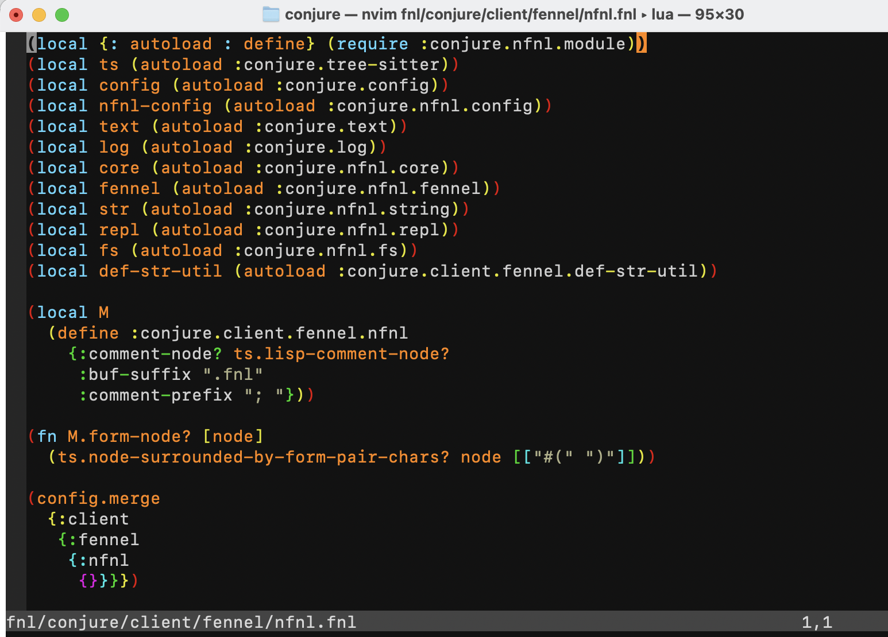

# Fennel Brief History and Development Environment

Let's talk about Fennel's history, a story about innovation.

## From Individual to Community: The Birth of Fennel

Here we will talk about four important figures; without them, this series of articles would not exist:

* Thiago de Arruda

It is said that Thiago once wanted to add asynchronous and multi-threaded support to Vim, but due to Vim's complex project architecture, it was difficult to make drastic modifications. He and several other developers realized that the only way to completely solve this problem was to rewrite a new Vim from scratch, which is the origin of Neovim. From Neovim's inception, he introduced Lua as a plugin script.

* Calvin Rose

One day, Calvin thought it would be interesting to have a Lisp that could run on top of Lua, so he casually carved out a prototype of Fennel, and then published it.

* Phil Hagelberg

Phil discovered Fennel online and then became Fennel's lead developer, successively developing the community, documentation, answering questions, and many other tasks. He currently maintains the Fennel community and its [official website](https://fennel-lang.org/).

* Olical Caldwell

Olical is a Clojure programmer and also a Neovim user. One day, he decided to develop his own **interactive development plugin** using the Clojure language, which was the beginning of [Conjure](https://github.com/Olical/conjure). Before Conjure began, other interactive development plugins for Vim already existed, but these plugins were often written in VimScript, making them difficult to read and modify.

Then, a turning point occurred. One day, Olical discovered that Fennel could compile into Lua, so he ported Conjure, which was originally written in Clojure, to Fennel. This port brought many benefits, as once ported, the plugin no longer needed to depend on the JVM and could run entirely within Neovim, which significantly improved speed. Thus, Conjure transformed from a Clojure project into a Fennel project.

I am a Conjure user, and I discovered Fennel because I used Conjure.

### "Successful Innovation" is a Systematic Response to Opportunity

These stories are not merely coincidences; they can be seen as **systematic responses** to specific opportunities. Drucker, in his book "Innovation and Entrepreneurship," proposed seven disciplines to explain how to systematically select innovation opportunities.

* **Thiago** created Neovim by capitalizing on the **unexpected event** of Vim's difficult code maintenance, offering a revolutionary solution to the **process need** for "better plugin development workflows."
* **Calvin** and **Phil** were the creator and promoter, respectively, of the **new knowledge** "Lisp on Lua." Phil, by building a community, successfully leveraged the increasing **demographic changes** of Neovim users, nurturing Fennel from a language prototype into an active ecosystem.
* **Olical** ported Conjure to Fennel by acutely capturing the **new knowledge** that Fennel could compile into Lua and applying it to the product, resolving existing performance bottlenecks.

These individuals were able to spark a revolution partly because of their superb technical skills, but more importantly, because they could **systematically identify and leverage these innovation opportunities**, transforming seemingly accidental chances into excellent software and thriving communities.

## Development Environment - Installation

The Fennel development environment primarily consists of the following components:

1. Neovim: Both an editor and a runtime.
2. Syntax highlighting plugin.
3. Rainbow parentheses plugin.
4. Conjure: A plugin supporting **interactive development**.
5. S-expression editing plugin.
6. Code formatting settings.

### Neovim

If you are using a Mac computer, use brew to install it.

* Install brew

```
/bin/bash -c "$(curl -fsSL https://raw.githubusercontent.com/Homebrew/install/HEAD/install.sh)"
```

* Install neovim

```
brew install neovim
```

If you already have neovim on your computer, don't forget to check the version first.

```
~$ nvim --version
NVIM v0.11.3
```

If it's not version `>= v0.11.3`, please consider upgrading Neovim if you encounter plugin incompatibility issues later.

### Fnlfmt

Fnlfmt is also installed directly on the operating system, so we use brew to install it:

```
brew install fnlfmt
```

### Neovim Plugins

* First, install a Plugin Manager; I use vim-plug.

vim-plug installation:

```
sh -c 'curl -fLo "${XDG_DATA_HOME:-$HOME/.local/share}"/nvim/site/autoload/plug.vim --create-dirs \
       https://raw.githubusercontent.com/junegunn/vim-plug/master/plug.vim'
```

* Next, install plugins via vim-plug.

Open your Neovim configuration file:

```
~$ nvim $HOME/.config/nvim/init.vim
```

In that file, paste the following content:

```
" Specify a directory for plugins.
call plug#begin(stdpath('data') . '/plugged')
" === Basic Setup ===
" color, look and feel 
Plug 'tomasr/molokai'

" === Highlight ===
" Syntax highlight for fennel language
Plug 'bakpakin/fennel.vim'

" rainbow parentheses
Plug 'frazrepo/vim-rainbow'

" === Interactive Development ===
" Conjure
Plug 'Olical/conjure'

" === S-expression editing ===
Plug 'guns/vim-sexp'
Plug 'tpope/vim-sexp-mappings-for-regular-people'
Plug 'kylechui/nvim-surround'
Plug 'jiangmiao/auto-pairs', { 'tag': 'v2.0.0' }

call plug#end()

colorscheme molokai
" Config the rainbow-parentheses
let g:rainbow_ctermfgs = [
    \ 'red',
    \ 'yellow',
    \ 'green',
    \ 'cyan',
    \ 'magenta',
    \ 'gray'
\ ]
" rainbow parentheses enabled for fennel
autocmd FileType fennel call rainbow#load()

let maplocalleader=","
let mapleader="\\"
" Make vim-sexp recognizes the fennel
let g:sexp_filetypes = 'fennel'
lua require("nvim-surround").setup()

function! Fnlfmt()
 !fnlfmt --fix %
 " :e is to force reload the file after it got formatted.
 :e
endfunction

augroup FennelOnSave
  " Format after save
  autocmd!
  autocmd BufWritePost *.fnl call Fnlfmt()
augroup END
```

Next, in Neovim's Normal Mode, execute the following commands:

```
:source %
:PlugInstall
```

After installation is complete, open a Fennel file, and it should look like this:



## Development Environment - Plugin Introduction

* vim-plug

vim-plug is a minimalist plugin manager. The most popular plugin manager currently is LazyVim, but since I have never particularly felt that my plugin loading speed was insufficient, I have not upgraded to it.

* tomasr/molokai

molokai is a color scheme. This is purely my personal preference, so I included it.

* Highlighting related

fennel.vim provides **syntax** highlighting for the Fennel language.
vim-rainbow makes **parentheses** appear in rainbow gradient colors.

* Interactive Development

Conjure is an interactive development plugin; it has many features when used with the Clojure language, so many that it takes considerable time to master. On the other hand, when used with the Fennel language, Conjure is also simplified, retaining only its minimalist core functionalities.

Interactive development allows you to easily extract parts of the code's syntax tree, send them to an interpreter for evaluation, and then quickly display the results in the editor.

* S-expression Editing

S-expression refers to a way of writing a function where the function name is placed within parentheses.

```
;; S expression
(fn your-fn-name [arg1 arg2]
  ...
)

;; M expression 
fn your-fn-name [arg1 arg2] (
  ... 
)
```

S-expression editing, like interactive development, is a concept unheard of by 95% of programmers. It allows you to edit directly on the programming language's syntax tree via commands. In other words, your smallest unit of editing is no longer individual characters (char), words (word), or lines (line), but rather elements (element) within the syntax tree.

## Development Environment - Automatic Formatting

The following VimScript code snippet allows your written Fennel code to automatically trigger the `fnlfmt` program for automatic formatting after saving.

```
function! Fnlfmt()
 !fnlfmt --fix %
 " :e is to force reload the file after it got formatted.
 :e
endfunction

augroup FennelOnSave
  " Format after save
  autocmd!
  autocmd BufWritePost *.fnl call Fnlfmt()
augroup END
```

## Interactive Development

* Download a practice git repo and switch directories

```
git clone https://github.com/humorless/auto-conjure.git
cd auto-conjure
```

* Open file

```
nvim fnl/auto-conjure/hello.fnl
```

And paste the following content:

```
(fn greet [name]
  (.. "Hello, " name "!"))

(greet :world)
```

Execute command `:w` to save the file.

* Use Neovim's Ex command to evaluate

```
:ConjureEval (+ 1 2 3)
```

Did you notice? When you press Enter, `(+ 1 2 3)` has been passed to a Fennel interpreter, and it has been evaluated.


* Use Neovim's hotkeys to evaluate (eval current-form)

1. Move the cursor to the first character `(` of the first line, then press `,ee`
2. Move the cursor to the first character `(` of the fourth line, then press `,ee`

Did you notice? When you press `,ee`, the **content within the parentheses** corresponding to the cursor has been passed to a Fennel interpreter and evaluated.


* Warning Message

If you encounter the following red text, you can ignore it for now; you can still operate normally. This red text usually appears if you press too quickly, and it hasn't had time to ask you if you are willing to trust a certain configuration file. Once you press allow, the warning will no longer appear.


## S-expression Editing

S-expression editing has many techniques; let's discuss the two most basic ones first.

1. slurp (swallow)
2. barf (spit out)

### Slurp

* First, add a string `:great` to the right of the `(greet ...)` function. Pay special attention here: in Fennel, consecutive strings can be represented by adding a colon before them.

```
(greet :world) :great
```
* Move the cursor to row, column (4, 14) and press `>)`


Did you notice? When you press `>)`, the **parenthesis** corresponding to the cursor is shifted to the right, precisely to the right of `:great`, as if it "swallowed" `:great`.


### Barf

* Move the cursor to row, column (4, 21) and press `<)`

Did you notice? When you press `＜)`, the **parenthesis** corresponding to the cursor is shifted to the left, precisely to the left of `:great`, as if it "spit out" `:great`.

### Quick Tip

Installation and setup can easily get stuck. If you're stuck, why not consider [writing to me](https://replware.dev/)? Or ask for help in the [Clojure community](https://t.me/clojuretw)?

## Summary

This chapter discussed some hacker stories and some hacker techniques: **interactive development** and **S-expression editing**.

To some extent, these individuals are like legendary programmers: hand-crafting an editor, hand-crafting a programming language, and hand-forging a community.

Would you rather tell others' legends? Or live within one?
