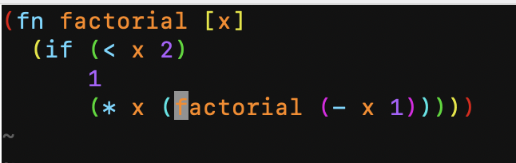

# Lisp In-depth—S-expression Editing

Many developers, shortly after starting to seriously write Lisp, deeply feel the inconvenience of editing parentheses. The first question is: "With so many parentheses, how should I format them?"

To be honest, many years ago when I first started writing Lisp, I formatted code like this below.

```
(fn factorial [x]
  (if (< x 2)
      1
      (* x (factorial (- x 1
                      )
           )
      )
  )
)
```

The above formatting style makes it convenient to visually align parentheses when writing code. On the other hand, when reading code, it greatly increases noise and drastically increases the number of lines, which is, of course, not ideal. The standard formatting style in the Lisp community is the one below.

```
(fn factorial [x]
  (if (< x 2)
      1
      (* x (factorial (- x 1)))))
```

The second formatting style is easier to read, but it brings up other problems: "When writing code manually, how can one ensure that parentheses are always paired?"

Next, we will break down the problems while introducing the functionalities of auxiliary plugins.

## Parenthesis Pairing Issues

This problem primarily has two levels:

1.  When reading code, how to instantly see the pairing relationship between parentheses.
2.  When writing code, how to ensure that parentheses can always be paired.

### Rainbow Parentheses

In day02, this plugin was installed via vim-plug:

```
" rainbow parentheses
Plug 'frazrepo/vim-rainbow'
```

Refer to the figure below; with this plugin, the front-back correspondence between parentheses becomes very clear.


In the Lisp community, there are actually different views on this plugin. Some people believe that after writing Lisp for a long time, the focus when reading code is not on parentheses, so it's not really necessary. The rainbow parentheses plugin, on the other hand, has the drawbacks of distracting attention and creating too much visual noise.

On the other hand, considering the existing thought patterns of beginners, I believe this is still quite necessary.

### Automatic Parenthesis Pairing

The corresponding plugin:

```
Plug 'jiangmiao/auto-pairs', { 'tag': 'v2.0.0' }
```

It allows a right parenthesis to be automatically generated every time you type a left parenthesis. And this applies no matter what you type: round parentheses, square brackets, curly braces, or string quote symbols. In other words, once this is enabled, your parentheses will be forced to be paired.

## Parenthesis Editing Issues

Many years ago, after I had just installed the "automatic parenthesis pairing" plugin, I actually found coding to be extremely cumbersome. Just two common editing frustrations almost made me give up "automatic parenthesis pairing" at one point.

1.  When parentheses are unpaired, it's difficult to correct.
2.  It's difficult to directly surround an already typed word with parentheses.

### Unpaired Parentheses

Because there are always times when "copy and paste" is needed during coding, Neovim's Normal Mode commands are used. However, the automatic parenthesis pairing plugin only manages Insert Mode commands. In other words, if I use "copy and paste" and am not careful, it can result in unpaired parentheses. But in such cases, because manually typed parentheses are always paired, you'll get stuck.

The solution is to use the Normal Mode command `x` to delete the character under the cursor, which allows you to directly remove unpaired parentheses.

### Surrounding with Parentheses

What is the need for surrounding with parentheses? For example, if I've already typed a word, 'local', and only after typing it do I realize I need to add parentheses, it's too late.

```
local
```

Because of "automatic parenthesis pairing", whether I insert parentheses before or after 'local', it will force the input of a pair of parentheses at once.

```
()local
```

In the first half-year of learning Lisp, I would use the `slurp` command on the right parenthesis `)` to make it 'eat' the word to its right. For half a year, I relied entirely on `slurp` and `barf` to expediently handle all such problems.

Later, I discovered there's actually an elegant solution: **using commands to surround with parentheses**.

-   `cseb`: Surrounds the element under the cursor with round parentheses.
-   `cse[`: Surrounds the element under the cursor with square brackets.
-   `cse{`: Surrounds the element under the cursor with curly braces.
-   `dsf`: Deletes the parentheses surrounding the element under the cursor (regardless of the type of parentheses).

What is an element? **Element** is a concept defined by the `vim-sexp-mappings-for-regular-people` plugin. The definition is a bit long, but readers only need to remember three rules from the definition:

-   A **compound form** is a text block delimited by paired `()`, `[]`, or `{}`.
-   If the cursor is within a string, the element is the current string.
-   If the cursor is on a paired structured parenthesis, the element is the current **compound form**.

To use the above commands, the required plugins are:

```
Plug 'guns/vim-sexp'
Plug 'tpope/vim-sexp-mappings-for-regular-people'
Plug 'kylechui/nvim-surround'
```

Sharp-eyed readers might notice the keyword: `vim-sexp`. That's right, these three sets are auxiliary plugins for S-expression editing. Also, I had actually been using S-expression editing for the first half-year, but I only knew how to use `slurp` and `barf`.

## Navigating and Editing within the Syntax Tree

Here are three more sets of commonly used commands:

-   Fast cursor movement
-   Moving elements
-   Deleting elements

### Fast Cursor Movement

In the Linux shell, you can move the cursor like this:

-   `CTRL + a`: Move to the beginning of the command line
-   `CTRL + e`: Move to the end of the command line

When editing a single line in Neovim, you can move the cursor like this:

-   `0`: Move to the beginning of the line
-   `$`: Move to the end of the line

Once you enter the world of Lisp, our perspective on code changes; the basic unit is no longer just a line of code or a word. One of the most important basic units is the **S-expression**, one after another.

When editing S-expressions, you can move the cursor like this:

-   `(`: Move to the left parenthesis of the S-expression.
-   `)`: Move to the right parenthesis of the S-expression.
-   `%`: Jump from a left parenthesis to its matching right parenthesis, or from a right parenthesis to its matching left parenthesis.

### Moving Elements

-   `>e`: Move the element under the cursor to the right.
-   `<e`: Move the element under the cursor to the left.

This function is particularly useful when writing conditional `if` statements. Sometimes, we might want to swap the true branch and the false branch. Executing a `>e` command on the branch's element completes the swap.

### Deleting Elements

We can also use the **element** and **compound form** concepts, as defined by the `vim-sexp-mappings-for-regular-people` plugin, as targets for deletion.

-   `dae`: Delete the element under the cursor.
-   `daf`: Delete the compound form under the cursor.

After deleting, move the cursor to another location and press the paste command `p`; the deleted element or compound form will be pasted in the new location.

### The Key to Usability: High-Level Editing Commands

Readers might ask: "What exactly makes S-expression editing so good? Is there a conceptual explanation?"

When engineers develop software, they inherently have the concept of a **syntax tree** in their minds. For example, we might want to swap the true branch and false branch of a conditional statement, where each branch is a sub-syntax tree. However, unfortunately, most of the time, editors cannot parse the syntax tree in the same way humans can. Therefore, when writing code, even if what we're thinking about is a highly abstract semantic: "swap true/false branch," we still have to translate this high-level semantic into low-level editor commands to complete the edit.

Because Lisp syntax itself reflects the syntax tree structure of the code, this special programming language design allows editor plugins to easily parse Lisp's syntax tree, thereby making **high-level editing commands** (i.e., S-expression editing) possible.

If it's not Lisp, when editing code, we move around within lines, words, and characters (Note 1); however, with Lisp, when editing code, we can navigate and edit within the syntax tree.

From a design perspective, we can also say that Lisp and S-expression editing are an embodiment of the UNIX philosophy:

```
Rule of Representation: Fold knowledge into data so program logic can be stupid and robust.
```

## Summary

Challenges often encountered by Lisp developers primarily revolve around parenthesis pairing and parenthesis editing.

To overcome these issues, this article introduced two major categories of practical editor tools and techniques:

-   Automated Parenthesis Management: Through editor plugins like rainbow parentheses and automatic parenthesis pairing, parenthesis relationships become clear at a glance, and their pairing is automatically ensured, resolving visual and input-related difficulties.

-   High-Level S-expression Editing: Unlike traditional line-by-line or word-by-word editing, Lisp allows us to operate directly at the syntax tree level. Through commands like surrounding with parentheses, fast cursor movement, moving elements, and deleting elements, the editing process becomes more intuitive and efficient.

If high-level programming languages enhance the expressiveness of code, then Lisp further enhances the expressiveness of the editor, allowing developers to freely navigate and manipulate at the syntax tree level.

---

Note 1: Modern IDEs, after using advanced libraries like Tree-sitter, can also obtain the code's syntax tree and even achieve effects similar to navigating the syntax tree. However, at the time I wrote this article, Lisp's S-expression editing still surpassed non-Lisp languages.
