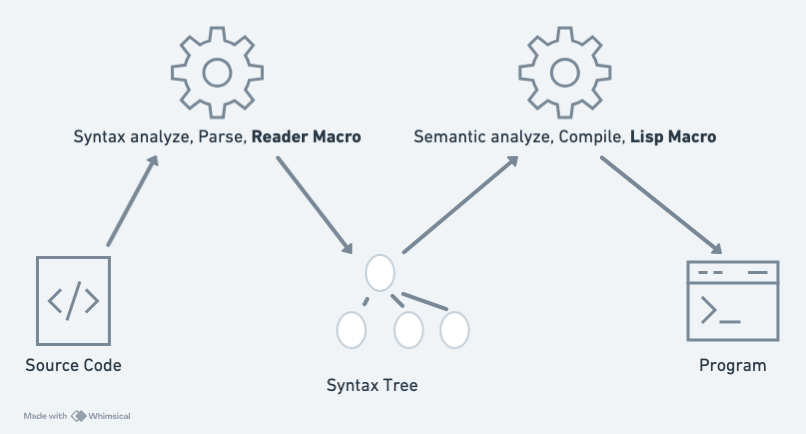

# Lisp In-depth—Macro

For Lisp, I have an opinion inherited from the Clojure community:

> When developing application software, try to use Lisp Macros as little as possible.

If it were the Common Lisp community, they might very well consider this view nonsense, because in the Common Lisp community it is widely believed that: "Macros are the essence of Lisp; they are not just syntactic sugar, but excellent tools that allow engineers to define new languages for specific problems, ultimately making code better at expressing its intent."

Furthermore, readers might have read the book *Hackers & Painters*, and also read Paul Graham's article that highly praises Lisp: [Beating The Averages](https://paulgraham.com/avg.html). Indeed, that article explains that because Lisp has Lisp Macros, it can make software engineers' productivity **surpass the mediocre**. Moreover, Paul Graham also provided evidence: "In Viaweb's codebase, as much as 20-25% of the code consists of Macros."

This part of the debate can be set aside for now; let's revisit whether to use them actively after learning about Macros.

## What Macros Does Lisp Provide?

Before discussing Macros, let's look at two representative types of syntax:

1.  `{:key value}` and `[:a :b :c]` : These two syntaxes for declaring Tables are called Literal Syntax. They are not S-expressions. This type of syntax is processed by the Lisp compiler during the read phase. If a Lisp compiler provides Reader Macros, then Reader Macros can create similar Literal Syntax.
2.  `->` : This is the syntax for Thread first. This syntax is in the form of an S-expression, so it can be implemented via Lisp Macros.

The diagram below shows the flow from source code to executable program, which can be divided into two phases of work:

-   Phase One: Lexical analysis and generation of the syntax tree, where Reader Macros operate. A Reader Macro is an extension mechanism for the Reader, thus it can provide new syntax.
-   Phase Two: Semantic analysis and compilation, where Lisp Macros operate. A Lisp Macro is an extension mechanism for the compiler, thus it can provide new semantics.

Most of the time, when we don't specifically mention Reader Macros, the Macros we are talking about refer to Lisp Macros operating in Phase Two.



### New Syntax (Presentation Form)

In Lua, the syntax for declaring a Table is:

```
local fruits = {"apple", "banana", "orange"}

local person = {
  name = "Alice",
  age = 30,
  city = "Taipei"
}
```

The corresponding Fennel syntax is:

```
(local fruits [:apple :banana :orange])
(local person {:age 30 :city :Taipei :name :Alice})	
```

And the operating principle of Reader Macros is as follows:

When the Reader reads source code, upon encountering the `[…]` characters, it triggers the corresponding Reader Macro for `[...]`, thereby parsing it into `(sequential-table ...)`; similarly, upon encountering the `{…}` characters, it triggers the corresponding Reader Macro for `{...}`, thereby parsing it into `(general-table ...)`. (*Here, it's assumed that the aforementioned Fennel syntax is implemented via Reader Macros, but in actuality, Fennel directly implements it within the Reader*)

Observing the examples above, it can be seen that Reader Macros only change the code's **presentation form**; in other words, they only provide new syntax.

### New Semantics (Behavior)

In contrast to Reader Macros, the core capability of Lisp Macros lies in defining new semantics, which means 'changing the code's **behavior**, not just changing its **presentation form**.' Let's explain this concept using Fennel's Thread First Macro `->` as an example.

In Fennel, if you want to perform a series of operations on a piece of data, you would nest function calls, writing from the inside out. For example, if you want to first add one to a number, then multiply by ten, and finally take the absolute value:

```
(math.abs (* 10 (+ 1 5)))
```

The reading order of this code is from the inner layer outwards: `(+ 1 5)` → `(* 10 ...)` → `(math.abs ...)`. This inside-out writing style makes code difficult to read and understand for complex sequential operations.

Fennel's `->` Macro solves this problem by allowing you to express the same logic in a more natural, linear way:

```
(-> 5
  (+ 1)
  (* 10)
  math.abs)
```

This is an excellent example of a Macro providing new semantics. Standard Lisp does not have built-in syntax for "passing the result of the previous operation as an argument to the next operation." `->` is a Macro, and its function is to transform the linear code you write during the compilation phase:

```
(-> 5 (+ 1) (* 10) math.abs)
```

into a nested S-expression:

```
(math.abs (* 10 (+ 1 5)))
```

This rewriting process is the manifestation of Macros giving new behavior to code. It's not just about replacing some characters, but about creating an entirely new operational flow and logic.

## Fennel's Reader Macro

Fennel's official website also implicitly mentions Reader Macros, though in a minimalist way.

> The parse-error and assert-compile hooks can be used to override how fennel behaves down to the parser and compiler levels. Possible use-cases include building atop fennel.view to serialize data with EDN-style tagging, or manipulating external s-expression-based syntax, such as tree-sitter queries.

Let me translate: The `parse-error` and `assert-compile` hooks can add new behaviors during Fennel's parser and compiler phases.

## Reconsidering Lisp Macros

In fact, many programming languages have the advanced topic of meta-programming. In other words, these meta-programming capable languages also provide functionality equivalent to Lisp Macros: that is, writing programs with programs.

However, being able to do equivalent things does not imply equivalent ease. Lisp Macros are absolutely the most expressive and easiest to write.

The biggest feature of Lisp Macros is that what you do is define a function that transforms one set of syntax trees into another set of syntax trees.

For example, the aforementioned Thread Macro `->`, its arguments are:

```
5 (+ 1) (* 10) math.abs
```
The arguments are a set of syntax trees.

And its output is:

```
(math.abs (* 10 (+ 1 5)))
```
The output is another set of syntax trees.

### Writing Lisp Macros

Since the probability of truly needing to write Lisp Macros in real-world software development scenarios is not high, the section on [How to write them](https://fennel-lang.org/macros) is left for readers to research on their own.

On the other hand, there is a special type of Lisp Macro usage that the Clojure community also encourages using frequently, which can be called With-Macros.

### With-Macros

For example, Fennel has a `with-open` syntax, which is a type of With-Macro.

Usage is as follows:

```
;; Basic usage
(with-open [fout (io.open :output.txt :w) fin (io.open :input.txt)]
  (fout:write "Here is some text!\n")
  ((fin:lines))) ; => first line of input.txt
```

Its function is to help handle closing files and releasing resources when file reading ends. In other words, although it also changes 'behavior,' the behavioral changes it makes usually only involve some context management at the beginning and end.

This type of With-Macro is particularly useful when dealing with function calls related to side effects.

In the Python language, there are no Lisp Macros, but there is a design equivalent to With-Macros, called Context Manager.

```
# Without using 'with'
f = open('test.txt', 'r')
try:
    content = f.read()
    # Even if an error occurs here, the f.close() in the finally block will still be executed.
    # This approach is more cumbersome and requires manual resource closing.
    print(content)
finally:
    f.close()

---

# Using 'with'
with open('test.txt', 'r') as f:
    content = f.read()
    # If an error occurs in the code here, `with` ensures that the `f` object's
    # `__exit__` method is automatically called, thereby correctly closing the file.
    # This approach is more concise and safe.
    print(content)
```

## Summary

This article explains several important concepts: Reader Macros, Lisp Macros, code presentation form, code behavior, and With-Macros. It also explains what the process of reading and compiling a programming language entails.

Next time you hear someone wanting to design or develop a new programming language or DSL, you might ask them: "Have you studied Lisp?"

If the answer is Yes, then this person has done their homework.
