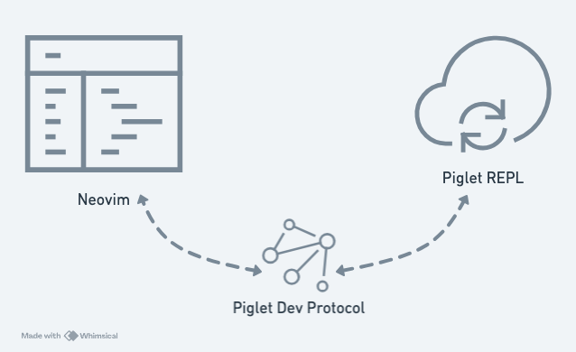

# Project Discussion—Conjure Piglet Client

[Conjure Piglet Client](https://github.com/humorless/conjure-client-piglet) is my second Neovim plugin project, and it was somewhat challenging.

## Problem Overview

> "Laurence, are you interested in Piglet? Would you like to develop Piglet?", Arne asked me. Piglet is his recently published new language, and of course, it's another Lisp.

> "Sure, where should I start?", I replied to him.

> "You have two options:
> 
> 1. Learn Emacs, because I have already developed Emacs plugin for piglet.
> 2. Develop a Neovim plugin."

I chose 2., and so this project began.

## Solution Architecture

After a quick read through [Piglet](https://github.com/piglet-lang/piglet)'s documentation and [Emacs Plugin](https://github.com/piglet-lang/piglet-emacs), my initial plan was as follows:

1. First, develop Fennel code to handle the Piglet Dev Protocol, that is, first try to enable Neovim to communicate with the Piglet REPL.
2. Then, package the code from step 1 into a new Conjure client, so that Conjure can support Piglet's interactive development.

The design of the Neovim plugin Conjure allows it to support multiple different programming languages; and the way it supports them is very clever, because Conjure itself is also designed to allow for plugin development. In other words, strictly speaking, Conjure Piglet Client is actually **a plugin for a Neovim plugin**.

Piglet Dev Protocol (PDP) is Piglet's interactive development protocol, and the workflow is: the editor opens a WebSocket server, the Piglet REPL connects as a client, and both parties exchange messages via CBOR (Concise Binary Object Representation, a binary data encoding format).

The diagram below illustrates the Piglet Dev Protocol: the editor and REPL communicate via WebSocket, with data packets encoded using CBOR.

Based on the above, there are at least two areas where I need to integrate third-party libraries:

1. WebSocket
2. CBOR

## Summary

Strictly speaking, this project and the previous auto-conjure project still share similarities: both are porting. In other words, the inherent difficulty of this type of project is more at the implementation level, rather than the design level.
