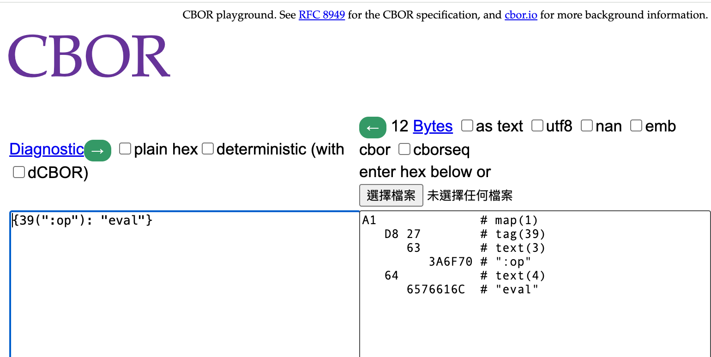

# Project Discussion—CBOR

When readers first hear about CBOR, they might find it unfamiliar and difficult to understand. Here's a quick explanation: readers can imagine it as a library similar to JSON encode, but its encoding method is binary, which cannot be directly interpreted by human eyes, but offers better performance.

## Problem Overview

If readers carefully examine the CBOR-related parts of the original [Emacs plugin](https://github.com/piglet-lang/piglet-emacs), they will find that: in the original Emacs plugin, the approach for the CBOR part was to copy and paste the implementation of a CBOR library and then customize it.

When I was porting this part, I was inclined to say: "If possible, the Conjure Piglet Client should directly depend on a Lua CBOR library." Such an approach of copying and modifying source code, like in the Emacs plugin, implicitly places enormous cognitive pressure on application developers.

Unexpectedly, this **modular porting method** I envisioned was much more difficult than I had imagined.

After establishing the websocket connection, I encoded the message with CBOR and sent it to the Piglet interpreter for evaluation. To my surprise, it failed immediately. I inspected the CBOR encoded result on the Piglet side using the [cbor.me](https://cbor.me/) website to understand the reason for the failure.

The problem was: Piglet expected a tag 39 to be added before keywords in the CBOR encoding.



## Solution Architecture

Since the README of [spc476/CBOR](https://github.com/spc476/CBOR) is relatively concise, and I am very unfamiliar with Lua—so unfamiliar that I barely understood `setmetatable`. Consequently, I was stuck: "How can I call the Lua cbor library to successfully insert tag 39 and have tag 39 modify the keyword in the message?"

During the development process, I asked the LLM several times, and the LLM provided several different calling methods, all of which were incorrect.

My prompt looked like this:
> Considering using the following Lua library https://github.com/spc476/CBOR, hoping that the hex result of `lua.encode({op = "eval"})` is "a1 d8 27 63 3a 6f 70 64 65 76 61 6c", i.e., hoping to insert a tag 39 to modify the `op` keyword. How should `lua.encode` be called?

In the end, I abandoned the LLM and went back to slowly read the README and Lua's API, finally figuring out the solution.

```lua
(local cbor (require :org.conman.cbor))

;; Define a keyword function, which can be used to register the __tocbor function
(fn keyword [s]
  ;; keyword changes the string $s => `:$s`
  ;; and return a table with the content is `{:v $changed_string}`
  ;; and the returned table has a `__tocbor` function in its metatable."
  (let [t {:v (.. ":" s)}
        mt {:__tocbor (fn [self]
                        (cbor.TAG._id self.v))}]
    (setmetatable t mt)))

;; Declare a msg, where its keys must be modified by the above function.
(local msg {(keyword "op") :eval (keyword "code") "(+ 1 1)"})

;; Encode the entire msg with cbor, cbor.encode will call the __tocbor function.
(cbor.encode msg)
```

### Structured Thinking Prompt

After overcoming the hurdle, I redesigned my prompt, adding a paragraph to guide the LLM's thinking after the original prompt:

```
 When trying to solve this problem, please think in the following order: 
 
 1. Is the desired functionality a scenario that the designer of the spc476 library might not have initially covered? 
 2. Has the library designer already applied a loose coupling mechanism for such situations, allowing users to make modifications later? 
 3. What are Lua's loose coupling mechanisms? 
 4. After considering 1, 2, and 3, how should lua.encode be called?
```

When I used this new prompt to ask the LLM to demonstrate library invocation, the quality of the LLM's output significantly improved. Some LLMs even succeeded; even the failed ones were just one step away.

## Summary

This article presents an AI application method using "structured thinking prompts," which can be said to have been born out of the challenge of CBOR encoding not matching Piglet's expected format.

To some extent, the problem solved this time is still a porting issue, similar to day20, day21, day22. However, it's "modular porting," where I simultaneously improved the system's modularity while porting.

If speed were the only concern, perhaps simply having the LLM directly port the CBOR from the Emacs plugin in a brute-force manner might have been faster, as it could potentially be completed solely by AI, with relatively less human intervention.

This leads to a paradoxical question: "AI excels at simple, brute-force approaches and does them quickly. However, can humans, as software developers, always coexist with inelegant code?"
