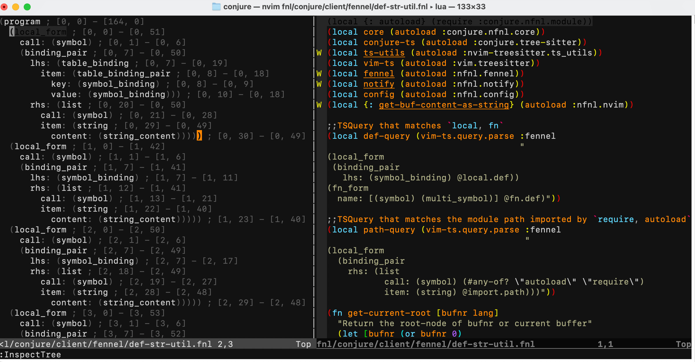
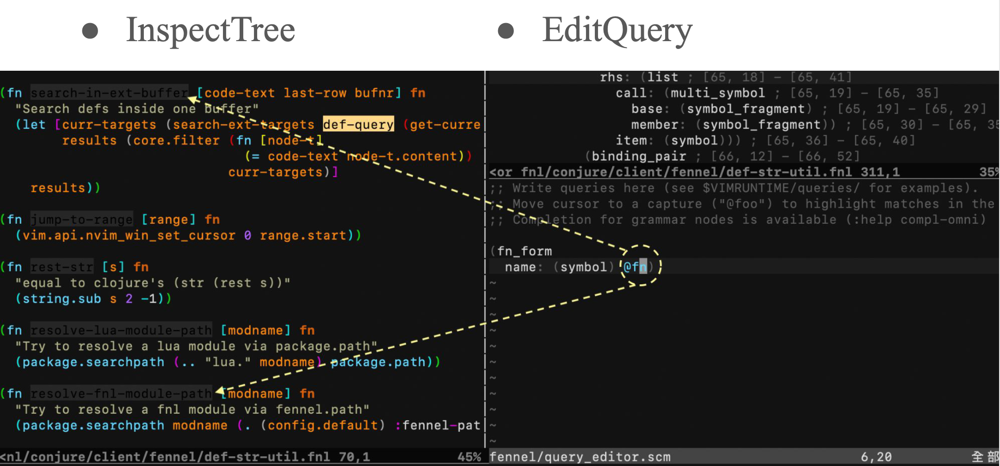

# Project Discussion—Tree-sitter Behind Jump to Definition

Consider the following requirement: You have a plain text file written in Chinese, containing a Chinese article. For some reason, you need to replace '如果' (rúguǒ - if) in the article with the English word 'if'. Many people might think, this is simple, just do a string replacement.

However, what if there's a problematic sentence in that Chinese article:

> 牛奶不如果汁好喝。

The aforementioned Naive string replacement would fail.

How can one develop a program to prevent it from being affected by such problematic sentences?

*   First, use formal linguistics to perform natural language syntax tree parsing on the data in the plain text file, for example:

```
;; If it rains, I won't go.

S (Sentence)
├── CP (Conditional Clause)
│   ├── C (Conjunction): 如果
│   └── S (Sentence)
│       └── VP (Verb Phrase)
│           └── V (Verb): 下雨
└── S (Main Clause)
    ├── NP (Noun Phrase): 我
    ├── Adv (Adverb): 就
    ├── Neg (Negative): 不
    ├── VP (Verb Phrase)
    │   └── V (Verb): 去
    └── Part (Modal Particle): 了
```
*   Query these generated syntax trees. First, find all conjunctions (C), then compare '如果' within these conjunctions. This way, it won't be affected by **problematic sentences**.

Programming languages can also undergo syntax tree parsing. In fact, the advanced features of modern editors: **syntax highlighting**, **auto-formatting**, and **jump to definition**. The cornerstone behind these capabilities is also the syntax tree parsing of programming languages.

## Problem Overview

In day24, we mentioned using Tree-sitter to parse code, which brings up two main challenges:

1.  How does Tree-sitter generate Fennel's syntax tree?
2.  Once the syntax tree is obtained, how do we query it?

## Solution Architecture

The first problem, generating the syntax tree, is actually the hardest, because we must provide Tree-sitter with a `grammar.js` file, within which the grammar rules for the Fennel language must be well-defined (Grammar Rules). Fortunately, on the official Tree-sitter website, grammar rules for many less common programming languages already exist!

Thus, the image below can be obtained, with the left side of the image being Tree-sitter's output.


For the query problem, we can make good use of Neovim's two Ex commands:

-   InspectTree
-   EditQuery

In the EditQuery window, after entering a Tree-sitter query, the successfully matched source code and syntax tree segments will automatically highlight, helping you visually confirm whether your intent matches the query results. I still haven't learned Tree-sitter's query syntax to this day; I just ask an LLM to generate it for me.



## Summary

Natural language and code themselves are data with implicit structures. By using syntax trees generated through parsing, we can understand, query, and manipulate their data in a precise manner, just like applying a database.
