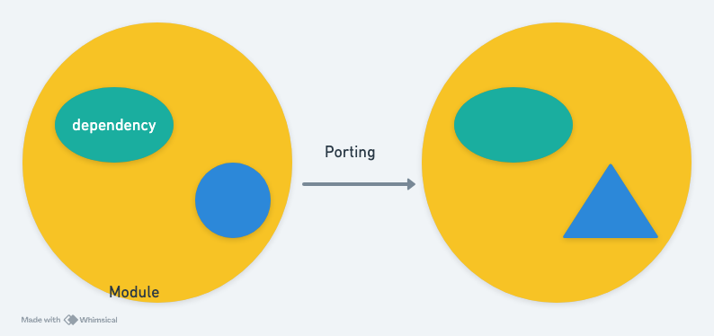
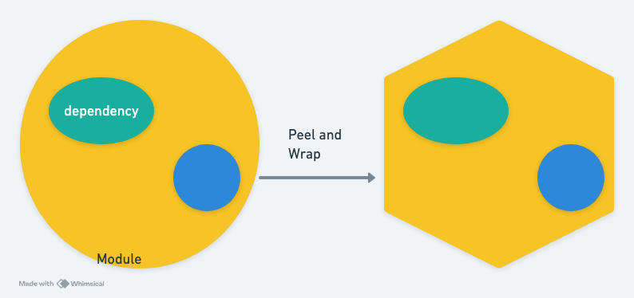

# Patterns and Principles—Uncertainty

Software development is a work full of uncertainty, which usually comes from two main aspects:

-   Clarification of user requirements
-   Application challenges of components

The above uncertainties are often particularly evident in **new development projects**.

New development projects sometimes do not involve real users, because real users are only obtained after the project goes live. In other words, no matter how detailed the specifications were written initially, they were all based on imagination of the users, and real user feedback remains full of uncertainty.

New development projects sometimes also adapt by changing some existing project practices: switching languages, architectures, databases, and so on. Or there might be a need to develop unprecedented new features, integrate new libraries, or deploy to new platforms. The above situations all involve applying new components, and it's highly possible that the documentation for these new components is vague, lacks examples; the components might have bugs, or depend on a certain library that conflicts with other parts of the system.

## Ways to Respond

Carefully considering the nature of uncertainty, it is essentially a lack of critical information, and this information is often **feedback-based information**. In other words, if we can adjust the development sequence or methods to obtain important information more quickly, this can rapidly reduce uncertainty.

### Walking Skeleton (Skeleton First)

When developing a new project, Walking Skeleton is a method that can quickly reduce uncertainty. Its concept is: "First integrate all components with side effects (IO), and then develop the core logic." A more advanced Walking Skeleton also includes completing a one-line deployment right from the start.

By adopting this development sequence, on one hand, the integration of highly uncertain components is brought forward, so the overall uncertainty in the system rapidly decreases at the project's inception. More importantly, once the system has a UI, non-developer collaborators can join the project to provide feedback; and if deployment is also in place, even feedback from real software users or clients can be gathered early.

Although Walking Skeleton is an extremely simple approach, it can rapidly reduce uncertainty and significantly lower project risks.

### Porting (Transplantation)

When planning many systems, it's often found that certain required modules do not exist, but they do exist on other platforms. In such cases, we can adopt porting as a way to reduce uncertainty.

Porting modules from other platforms can be said to quickly reduce uncertainty in 'requirements direction'. Generally, when we talk about requirements, the term often has two meanings: one is the requirements directly from real users. The other meaning is the **reasonable module interface** needed due to external user requirements. Designing reasonable module interfaces is actually very difficult; many classic interface designs written in books are the result of countless predecessors' attempts, failures, and improvements.

Adopting the porting approach can focus uncertainty on software implementation and dependencies, significantly reducing overall uncertainty.

### Peel and Wrap (Peeling and Grafting)

When discovering that certain required modules do not exist, besides re-developing them yourself, porting can also be considered.

On the other hand, during the software development process, many times we also have third-party libraries available for use; however, while third-party modules can be used, they are often difficult to use.

When would this happen? For example, when using a language like Clojure, which primarily supports functional programming, if we need to use less common use cases, we might resort to third-party libraries, specifically pure Java libraries. However, a characteristic of Java libraries is that they come with a multitude of types. If directly referenced, it would fill Clojure code with Java types.

In such cases, a better approach is Peel and Wrap: before referencing a Java library, peel back layer by layer until a layer is found that has not yet transformed data into a myriad of types. Directly strip off the upper layers of that module and rewrite them using the Clojure language.

This approach allows leveraging third-party libraries (reducing uncertainty) while ensuring that they do not contaminate the entire system.

The Peel and Wrap method comes from a tweet by Arne Brasseur:
> Much of Clojure development is peeling back layers and layers of Java libraries to get to the bit that actually matters, then wrapping that in a tiny API layer over plain data.

## Related Theory

These patterns for addressing uncertainty actually echo the concept of **Adjacent Possible** proposed by complexity scientist Stuart A. Kauffman.

Kauffman believes that the evolution of biological systems (as well as human economic, cultural, and technological systems) is not a random leap, but rather a gradual exploration and expansion from the current state towards its **Adjacent Possible** space. This 'Adjacent Possible' is the set of all possible next states that a system can reach, based on all its currently possessed components and configurations.

For instance, in biological evolution, new gene mutations or traits typically emerge based on existing genes and environments, rather than appearing out of nowhere. Similarly, in software development, we can view our current tech stack, team knowledge, and user feedback as our 'current state'.

### Adjacent Possible: The Duality of Constraints and Opportunities

A key characteristic of the **Adjacent Possible** lies in its duality: it is **both a constraint and an opportunity**.

*   **As a Constraint:** The current state of the system dictates where you can go. You cannot jump directly from a Java project to a mature and complex Rust project unless you first acquire Rust knowledge, find relevant libraries, and complete architectural validation. Existing technical debt, team skills, and architectural complexity all limit the scope of what we can effectively explore. If we blindly 'leap forward', the probability of failure will be extremely high.
*   **As an Opportunity:** At the same time, the current state is also the source of all new possibilities. All the classes, functions, interfaces, and data structures you already possess are potential 'LEGO blocks'. When you combine these blocks, a new, viable state will emerge in your **Adjacent Possible**. **Effective development strategy is to cleverly use existing blocks, or introduce the minimum amount of external blocks, to expand this space.**

From this perspective, the aforementioned development patterns can all be understood as systematically managing these 'constraints' and 'opportunities':

*   **Walking Skeleton:** Is a method for **quickly exploring the Adjacent Possible** by establishing a working foundation as early as possible. It first stabilizes the most uncertain aspects (I/O, deployment), **transforming these high-risk constraints into stable cornerstones**. This new state allows the team to more safely explore subsequent features and find new 'Adjacent Possible' directions from early feedback.

*   **Porting:** Is leveraging external resources to strategically expand the boundaries of the **Adjacent Possible**. It introduces verified solutions from other domains into our **Adjacent Possible** space, **directly bypassing the uncertainty constraints of requirements direction**, thereby skipping lengthy design and trial-and-error processes.

*   **Peel and Wrap:** Is also a method of leveraging external resources (opportunities) while carefully **managing the constraints brought by external dependencies**. By creating a thin API layer, it transforms external components into new tools that conform to the system's own style, preventing the **Adjacent Possible** space from being contaminated by chaotic external dependencies, and ensuring internal consistency of the system.

In summary, these strategies are not merely technical practices, but rather systematic ways to manage uncertainty and accelerate effective exploration within the **Adjacent Possible** space. Their core idea is: **first establish a stable cornerstone, transforming constraints into opportunities**, then gradually expand to the next viable state in an organized and targeted manner, rather than blindly venturing into the unknown.

## Summary

Software development is full of uncertainty, primarily stemming from user requirements and technical challenges. This article introduces three patterns for addressing this uncertainty:

-   Skeleton First
-   Porting
-   Peeling and Grafting

These patterns are not merely technical tricks, but rather a systematic management of uncertainty, whose core philosophy aligns with the concept of **Adjacent Possible** proposed by complexity scientist Stuart A. Kauffman. These strategies all involve establishing a stable cornerstone, then progressively exploring and expanding in an organized and targeted manner, ultimately accelerating the discovery of solutions within a feasible scope.
